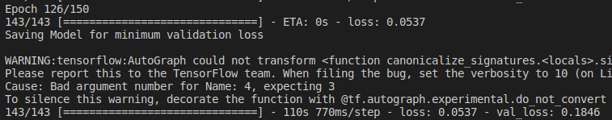
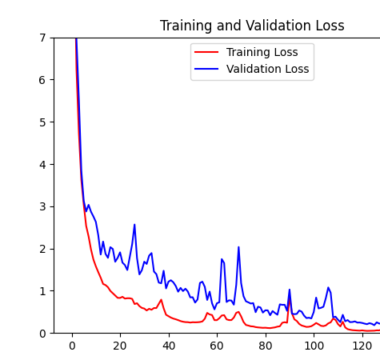

# Speed Prediction using Optical Flow and 2D CNN

# About the challenge: 
[Comma.AI Speed Challenge](https://github.com/commaai/speedchallenge)
This challenge was developed by Comma.AI to predict the speed of a car from a video.

# Pipeline

Tensorflow Version: 2.2.0

Steps for implementing speed estimation:
1. Save the images from the `train.mp4` and `test.mp4` video using `DatasetConverter.py`.
2. Convert the images from the videos, computer dense optical flow on the image sequence and save optical flow images using `VideoToOpticalFlowImage.py`.
3. Train the network below on optical flow images and save the best performing model using `custom callback`.
4. Use the saved model on the testing dataset using `UseModel.py`.

# Optical Flow
Optical flow is computed on two adjacent image frames in a video, converted it to grayscal and applying `cv2.calcOpticalFlowFarneback()` which outputs two matrices of same shape as compared to the input shape. Each pixel of the output images denotes the change in its position and speed respectively with respect to the previous image frame. For visualization and training, the output images are combined into single HSV color channel based image.

# Data Augmentation
Every single images is flipped horizontally having the target value same as the images from which it is derived. This data augmentation played significant role in reducing validation loss.

# Model

The following model is a 2D CNN based model made to be used on optical flow images. As compared to a 3D CNN based model trained on images from video, using optical flow with 2D CNN is faster to train and has lower MSE loss.

  

# Training:

Trained the 2D CNN for 150 epochs to get a validation MSE loss of 0.18 and training MSE loss of 0.05

  

  

# Output:

This gif below has the prediction vs ground truth for the images on which the model is trained:

This gif is the prediction on the test images:

# Learning:
1. Image augmentation significantly improves the speed estimation of the model
2. Writing custom data generators for reading batches of images and ground truth
3. 2D CNN with optical flow performs better than 3D CNN in terms of training time and accuracy

# Reference:
1. [speed-estimation-of-car-with-optical-flow](https://github.com/laavanyebahl/speed-estimation-of-car-with-optical-flow)
2. [speed-prediction-challenge](https://github.com/satyenrajpal/speed-prediction-challenge)