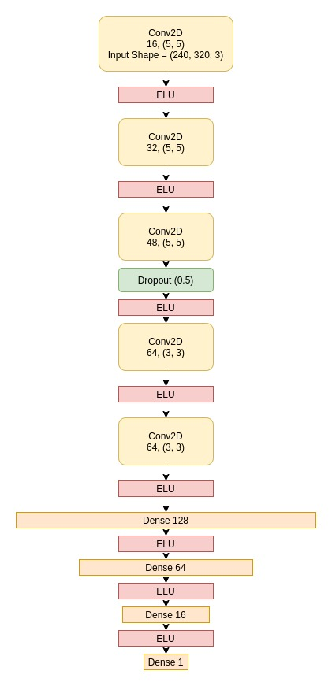

# Speed Prediction using Optical Flow and 2D CNN

# Pipeline

1. Extract Images from the video, convert them to optical flow and save the optical flow images
2. Train the network below on optical flow 

# Model

# Output:
'''
loss: 0.0939 - val_loss: 0.1837
'''

# Learning:
1. Image augmentation significantly improves the speed estimation of the model
2. Writing custom data generators for reading batches of images and ground truth
3. 2D CNN with optical flow performs better than 3D CNN in terms of training time and accuracy